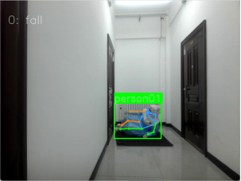
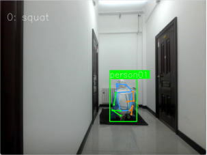
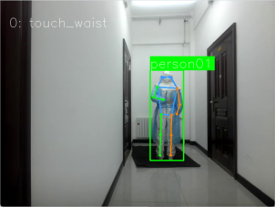
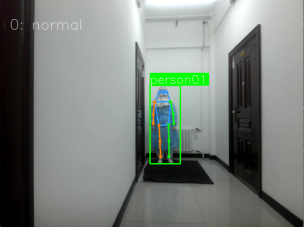
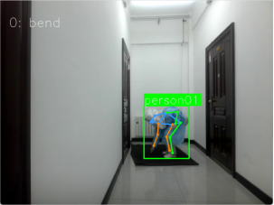
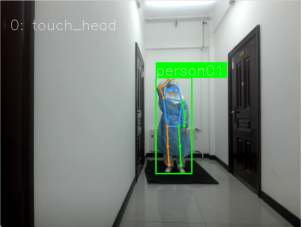

# HumanMMpose

基于 OpenMMLab MMPose 的人体姿态估计与实验室异常动作识别项目。项目主入口为：

```text
demo/inferencer-tuili.py
```

该脚本会读取图片、视频或文件夹，调用 `MMPoseInferencer` 完成人体关键点检测与可视化，并在推理过程中输出检测框处理、关键点检测、骨骼绘制、LSTM 预测等环节的耗时统计，便于分析实时推理性能。

## 效果展示

| 示例 1 | 示例 2 | 示例 3 |
| --- | --- | --- |
|  |  |  |

| 示例 4 | 示例 5 | 示例 6 |
| --- | --- | --- |
|  |  |  |

## 项目功能

- 支持图片、视频或文件夹输入。
- 默认使用 MMPose 的 `human` 2D 人体姿态模型。
- 支持 GPU 或 CPU 推理。
- 默认显示可视化窗口，并绘制人体检测框和骨骼关键点。
- 支持保存可视化结果和预测结果。
- 推理过程中统计各阶段耗时和 FPS。
- 可扩展 LSTM 动作识别流程，用于异常动作检测。

## 目录说明

```text
demo/inferencer-tuili.py      主推理脚本
demo/                         Demo 和测试脚本
AR/                           动作识别相关代码
decision/                     威胁或动作决策相关代码
configs/                      模型配置文件
mmpose/                       MMPose 源码及项目扩展代码
video/                        本地测试视频目录
vis_results/                  可视化结果目录
environment.yml               Conda 环境配置
```

说明：`AR/data/` 为本地数据目录，已加入 `.gitignore`，不会提交到 Git 仓库。

## 环境准备

推荐使用 Conda 创建环境：

```bash
conda env create -f environment.yml
conda activate openmmlab
```

如果没有使用 `environment.yml`，需要至少准备以下依赖：

```bash
pip install torch torchvision
pip install -U openmim
mim install mmengine
mim install "mmcv>=2.0.0"
mim install "mmdet>=3.0.0"
pip install -e .
```

根据本机 CUDA、PyTorch 和 MMCV 版本不同，安装命令可能需要调整。

## 快速运行

在项目根目录执行：

```bash
python demo/inferencer-tuili.py
```

脚本默认输入为：

```text
video/test414.mp4
```

也可以指定自己的图片或视频：

```bash
python demo/inferencer-tuili.py video/normal01.mp4
```

使用 CPU 推理：

```bash
python demo/inferencer-tuili.py video/normal01.mp4 --device cpu
```

保存可视化结果：

```bash
python demo/inferencer-tuili.py video/normal01.mp4 --vis-out-dir vis_results
```

保存预测结果：

```bash
python demo/inferencer-tuili.py video/normal01.mp4 --pred-out-dir pred_results
```

查看可用模型别名：

```bash
python demo/inferencer-tuili.py --show-alias
```

## 常用参数

| 参数 | 默认值 | 说明 |
| --- | --- | --- |
| `inputs` | `video/test414.mp4` | 输入图片、视频或文件夹路径 |
| `--pose2d` | `human` | 2D 姿态估计模型别名或配置文件路径 |
| `--pose2d-weights` | `None` | 2D 姿态模型权重路径 |
| `--pose3d` | `None` | 3D 姿态估计模型别名或配置文件路径 |
| `--pose3d-weights` | `None` | 3D 姿态模型权重路径 |
| `--det-model` | `None` | 检测模型配置或别名 |
| `--det-weights` | `None` | 检测模型权重路径 |
| `--det-cat-ids` | `0` | 检测类别 ID，人体类别通常为 `0` |
| `--device` | `cuda:0` | 推理设备，可改为 `cpu` |
| `--show` | `True` | 显示可视化窗口 |
| `--draw-bbox` | `True` | 绘制检测框 |
| `--bbox-thr` | `0.3` | 检测框置信度阈值 |
| `--nms-thr` | `0.3` | NMS 阈值 |
| `--kpt-thr` | `0.3` | 关键点置信度阈值 |
| `--tracking-thr` | `0.3` | 跟踪阈值 |
| `--vis-out-dir` | 空 | 可视化结果保存目录 |
| `--pred-out-dir` | 空 | 预测结果保存目录 |
| `--show-progress` | `False` | 显示推理进度条 |
| `--show-alias` | `False` | 输出可用模型别名 |

## 推理输出

运行过程中，脚本会打印各阶段耗时，例如：

```text
检测框处理时间
关键点检测时间
骨骼点绘制时间
LSTM预测时间
推理过程性能分析
总帧数
处理帧数
模型初始化时间
平均处理时间
处理速度 FPS
```

脚本当前会每隔一帧处理一次视频帧，用于提升实时性。

## 数据和大文件说明

- `AR/data/` 是本地训练或测试数据目录，不建议提交到 Git。
- 视频文件通常较大，GitHub 单文件限制为 100 MB。大视频建议放在本地、网盘或使用 Git LFS 管理。
- 如果推送时遇到大文件限制，可以将对应视频加入 `.gitignore`，并从 Git 索引中移除：

```bash
git rm --cached path/to/video.mp4
git add .gitignore
git commit --amend --no-edit
```

## 常见问题

### 1. 找不到默认视频

默认输入是 `video/test414.mp4`。如果本地没有该文件，请在命令中指定实际存在的视频路径：

```bash
python demo/inferencer-tuili.py your_video.mp4
```

### 2. CUDA 不可用

如果没有 GPU 或 CUDA 环境未配置，使用 CPU 运行：

```bash
python demo/inferencer-tuili.py your_video.mp4 --device cpu
```

### 3. 模型权重下载失败

当 `--pose2d human` 使用模型别名时，MMPose 会根据元信息加载默认权重。如果网络不可用，可以提前下载权重，并通过 `--pose2d-weights` 指定本地路径。

## 主入口

本项目的主要运行文件是：

```bash
python demo/inferencer-tuili.py
```
